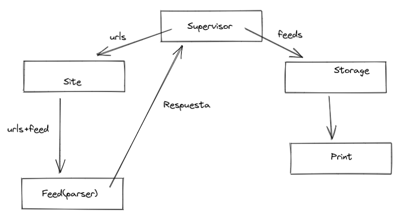
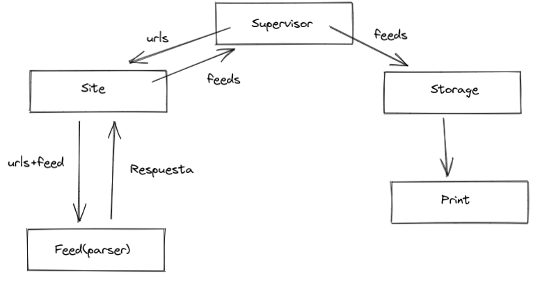

# Laboratorio 3: Programación Concurrente Usando Actores en Scala

## Primera parte: Diseñando la arquitectura

La arquitectura que definimos se puede observar en el siguiente gráfico,tiene como actor principal a un **Supervisor** que se encarga de leer el archivo de suscripciones y luego una vez que obtuvo el contenido de los *feeds* lo manda a **Storage** para que se guarde en el disco.

Los pasos intermedios del proceso mencionado anteriormente son realizados por **Site** que realiza el pedido HTTP a un URL, **Feed** parsea el contenido de esa respuesta y luego se la envía al **Supervisor**.

Para poder implementar la parte 3, la modificamos de forma que nos permita implementar un *request-responde*. Entonces el **supervisor** se encarga de la construcción de los *feeds*, recibe un mensaje de `SubscriptionApp.scala` con los campos necesarios de los *feeds* a los cuales se desea suscribirse (id, name, url). Luego realiza un *ask* hacia el actor **Site**, que tiene como función administrar las suscripciones, haciendo la consulta http, por medio de futuros, debido a que el éxito de esta consulta no está bajo nuestro control y de esta forma no se bloquean los demás actores al esperar la respuesta de otro actor y no se viola la concurrencia. 

A medida que se van recibiendo los *feed* se pasan al actor **Feed** que parsea las respuestas http y una vez que obtuvo el contenido, **Site** envia todo al **Supervisor** (aquí es donde vemos la jerarquía que impone el *request-respode*). Este último actor, pasa los *feeds* a **Storage** que cumple con la función de guardar el contenido en disco, y el actor principal detiene su ejecución.

## Sexta parte
### Preguntas a responder

- Si quisieran extender el sistema para soportar el conteo de entidades nombradas del laboratorio 2, ¿qué parte de la arquitectura deberían modificar? Justificar.

Se podría agregar otro actor que se encargue del conteo de entidades, realizando las modificaciones pertinentes en **Supervisor** para poder entablar la comunicación. Sería conveniente usar un ask-pattern para que este nuevo actor reciba los *feeds* y de esta forma poder responder con las entidades nombradas, para realizar el conteo se puede reutilizar el código del lab anterior que ya tiene resuelta esta cuestión.

- Si quisieran agrupar las suscripciones por sitio (i.e. todas las del New York Times juntas, todas las del Chicago Tribune juntas, etc.), de manera que cada página genere su archivo conteniendo toda la información de las suscripciones de dicha página:

- ¿Cómo debería modificar la arquitectura para que refleje esa jerarquía? Justifique.

- ¿Qué problema trae implementar este sistema de manera síncrona?

Realizar el sistema de manera síncrona nos implicaría mandar un *feed* a la vez para que realice el proceso de suscripciones. En nuestro caso, se genera un hilo para cada feed y de esta forma las suscripciones se generan simultáneamente. En nuestro caso la diferencia no es mucha xq solo manejamos pocas suscripciones, pero cuando si el número aumenta considerablemente el modelo de actores tiene la ventaja en cuanto a eficiencia y funcionalidad.

- ¿Qué les asegura el sistema de pasaje de mensajes y cómo se diferencia con un semáforo/mutex?

El sistema de pasaje de mensajes nos asegura que nuestro modelo no se quede esperando a un mensaje que en el peor de los casos podría no llegar. Esto quiere decir que el actor no se va a quedar esperando a recibir una respuesta, sino que va a procesar los mensajes que tenga pendientes, al igual que los otros actores, por lo que no son dependientes unos de los otros, esta es la diferencia principal que tiene con los semáforos/mutex ya que en estos los eventos los eventos presentan una fuerte dependencia los unos de los otros y los actores trabajan de forma asíncrona.
